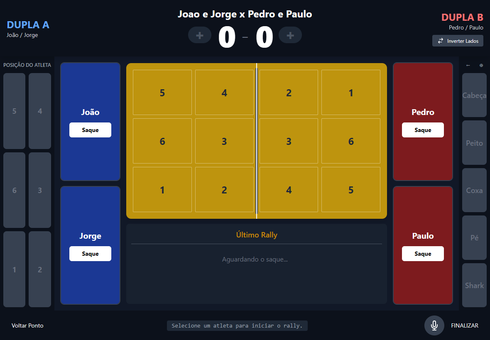
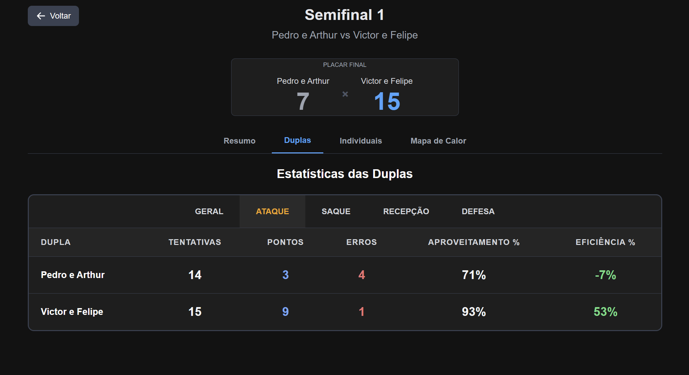

# FTV-Scout


FTV-Scout é uma aplicação web progressiva (PWA) desenvolvida para realizar a notação de ações e análise estatística de partidas de futevôlei. O sistema permite registrar ações, pontos, técnicas e posicionamento dos atletas em tempo real durante as partidas para gerar estatísticas dos atletas e duplas.

## 📸 Screenshots

<div align="center">

### Notação de Partida


### Dashboard de Estatísticas


</div>

## Funcionalidades Principais

- 📊 Notação em tempo real de partidas
- 🎯 Registro automático do tipo de ação (ataque, defesa, recepção, saque, etc.)
- 📍 Marcação de zonas da quadra e posicionamento dos atletas
- 🔄 Sistema de saque alternado automático
- 📈 Estatísticas completas por atleta e dupla
- 🎨 Interface responsiva otimizada para tablets
- 🔄 Inversão visual dos lados da quadra
- 📱 Suporte PWA para instalação como app


## Tecnologias Utilizadas

### Backend
- **[FastAPI](https://fastapi.tiangolo.com/)** - Framework web moderno e rápido
- **[SQLAlchemy](https://www.sqlalchemy.org/)** - ORM para Python
- **[SQLite](https://www.sqlite.org/)** - Banco de dados (padrão)
- **[Poetry](https://python-poetry.org/)** - Gerenciador de dependências Python
- **Python 3.13+**

### Frontend
- **[React 19](https://react.dev/)** - Biblioteca JavaScript para UI
- **[TailwindCSS](https://tailwindcss.com/)** - Framework CSS utility-first
- **[Vite PWA](https://vite-pwa-org.netlify.app/)** - Plugin PWA para Vite

### DevOps & Ferramentas
- **[Git](https://git-scm.com/)** - Controle de versão
- **[GitHub Actions](https://github.com/features/actions)** - Pipeline CI automatizado
- **[Commitizen](https://commitizen-tools.github.io/commitizen/)** - Conventional commits
- **[ESLint](https://eslint.org/)** - Linter JavaScript

#### Testes & Cobertura
- **[Pytest](https://pytest.org/)** - Testes backend (Python)
- **[Vitest](https://vitest.dev/)** - Testes frontend (JavaScript)
- **Coverage** - pytest-cov (backend) + V8 (frontend)

## Pré-requisitos

- **Node.js** 18+ e npm/yarn
- **Python** 3.13+
- **Poetry** (gerenciador de dependências Python)

### Instalação do Poetry

```bash
pipx install poetry
```

Ou

```bash
# Windows
(Invoke-WebRequest -Uri https://install.python-poetry.org -UseBasicParsing).Content | py -

# Linux/macOS
curl -sSL https://install.python-poetry.org | python3 -
```

## Como Rodar o Projeto

### Backend

```bash
# Navegue até a pasta do backend
cd backend

# Instale as dependências
poetry install

# Ative o ambiente virtual
poetry shell

# Inicie o Banco de Dados no primeiro uso
poetry run python .\init_db.py

# Rode o servidor (porta 8000)
fastapi dev ./src/main.py
```

O backend estará disponível em:
- API: `http://localhost:8000`
- Documentação Swagger: `http://localhost:8000/docs`
- Documentação ReDoc: `http://localhost:8000/redoc`

### Frontend

```bash
# Em outro terminal, vá até a pasta do frontend
cd frontend

# Instale as dependências
npm install

# Rode o servidor de desenvolvimento (porta 5173)
npm run dev
```

O frontend estará disponível em:
- Aplicação: `https://localhost:5173` (HTTPS com certificado auto-assinado)

> **Nota:** O frontend possui um proxy reverso configurado que redireciona requisições `/api` para `http://localhost:8000`

---

### Rodando com Ngrok (Acesso Externo)

Com o proxy reverso configurado no frontend, você só precisa expor o frontend via ngrok:

```bash
# 1. Rode o backend localmente
cd backend
poetry run uvicorn src.main:app --reload --host 0.0.0.0 --port 8000

# 2. Em outro terminal, rode o frontend
cd frontend
npm run dev

# 3. Em um terceiro terminal, exponha o frontend com ngrok
ngrok http https://localhost:5173
```

O ngrok fornecerá uma URL pública (ex: `https://abc123.ngrok.io`) que você pode acessar de qualquer lugar. O proxy reverso do frontend automaticamente redirecionará as chamadas da API para o backend local.

**Vantagens:**
- ✅ Apenas uma URL pública necessária
- ✅ Backend permanece seguro (não exposto)
- ✅ Proxy reverso gerencia a comunicação automaticamente

---

### Rodando em Rede Local (Acesso via IP)

Para acessar de tablets na mesma rede:

#### Passo 1: Descubra seu IP local

```bash
# Windows
ipconfig
# Procure por "Endereço IPv4" (ex: 192.168.1.100)

# Linux/macOS
ifconfig
```

#### Passo 2: Configure o backend

```bash
cd backend
poetry run uvicorn src.main:app --reload --host 0.0.0.0 --port 8000
```

#### Passo 3: Configure o frontend

O frontend já está configurado com `--host` no script `dev`:

```bash
cd frontend
npm run dev
```

O Vite automaticamente exibirá os endereços de rede:

```
  ➜  Local:   https://localhost:5173/
  ➜  Network: https://192.168.1.100:5173/
```

#### Passo 4: Acesse do tablet/celular

No dispositivo móvel conectado à mesma rede Wi-Fi, acesse:

```
https://192.168.1.100:5173
```

> **⚠️ Aviso de Certificado:** Como o frontend usa HTTPS com certificado auto-assinado, você precisará aceitar o aviso de segurança no navegador do dispositivo móvel.

**Configuração Alternativa (HTTP):**

Se preferir evitar o aviso de certificado, você pode desabilitar o HTTPS temporariamente:

1. Edite `frontend/vite.config.js`:
```javascript
server: {
  https: false,  // Altere para false
  proxy: {
    '/api': {
      target: 'http://192.168.1.100:8000',  // Use seu IP local
      changeOrigin: true,
    },
  },
}
```

2. Acesse via HTTP: `http://192.168.1.100:5173`

> **Nota:** Ao desabilitar o certificado, o PWA não será instalado no dispositivo móvel.
---

## Estrutura do Projeto

```
FTV-Scout/
├── backend/
│   ├── src/
│   │   ├── atletas/         # Módulo de atletas
│   │   ├── duplas/          # Módulo de duplas
│   │   ├── partidas/        # Módulo de partidas
│   │   ├── pontuacao/       # Módulo de pontuação
│   │   ├── estatisticas/    # Módulo de estatísticas
│   │   ├── core/            # Configurações e base de dados
│   │   └── main.py          # Aplicação FastAPI
│   ├── pyproject.toml       # Dependências Python
│   └── dados.db             # Banco de dados SQLite
│
├── frontend/
│   ├── src/
│   │   ├── components/      # Componentes React
│   │   ├── pages/           # Páginas da aplicação
│   │   ├── hooks/           # Custom hooks
│   │   ├── services/        # Serviços de API
│   │   └── App.jsx          # Componente principal
│   ├── package.json         # Dependências Node
│   ├── vite.config.js       # Configuração Vite
│   └── tailwind.config.js   # Configuração Tailwind
│
└── README.md
```

## 📱 PWA (Progressive Web App)

O projeto está configurado para funcionar como PWA. Para instalar:

1. Acesse a aplicação pelo navegador
2. Clique no ícone de instalação (geralmente na barra de url)
3. Confirme a instalação

O app ficará disponível na tela de aplicativos do dispositivo.

## Contribuindo

Este projeto usa [Conventional Commits](https://www.conventionalcommits.org/):


## Licença

GPL-3.0 license


## Autor

**Felipe Direito** - [fedireito92@gmail.com](mailto:fedireito92@gmail.com)

---

**Desenvolvido com ❤️ para a comunidade de Futevôlei**
